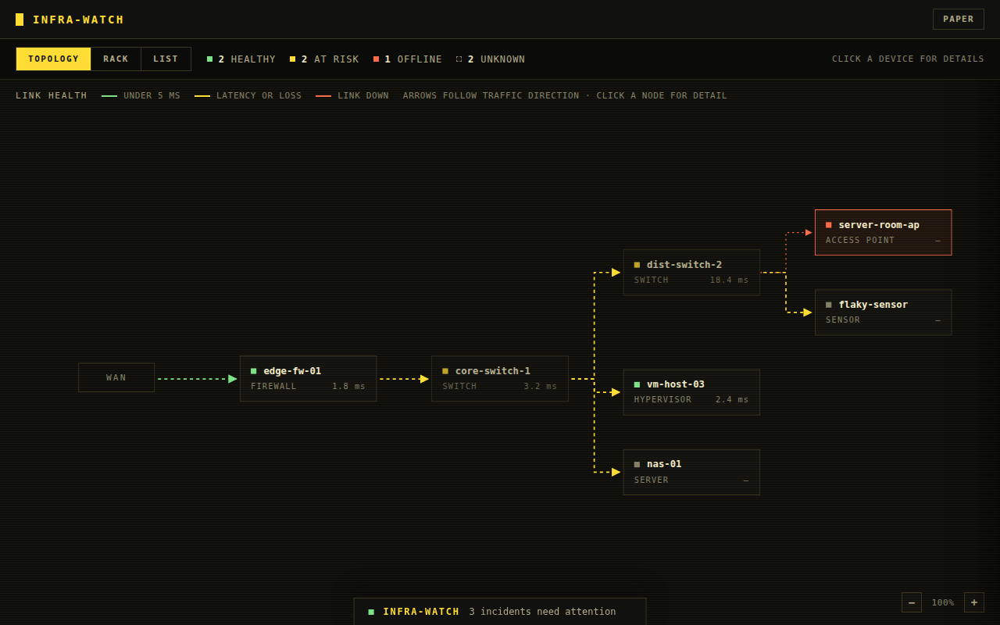
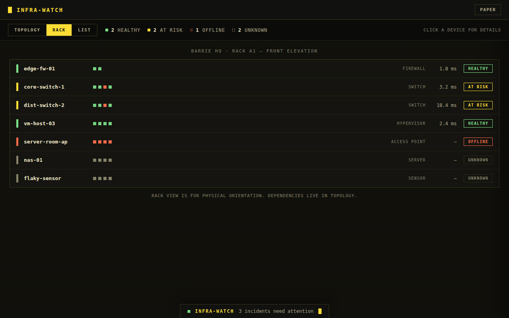
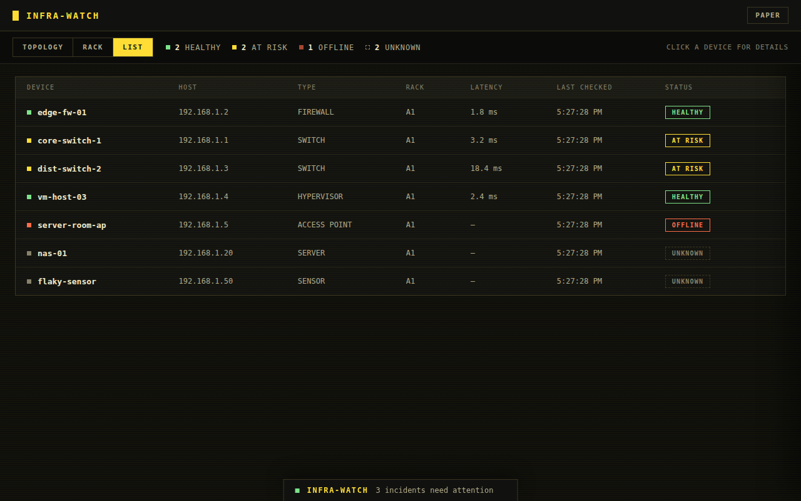
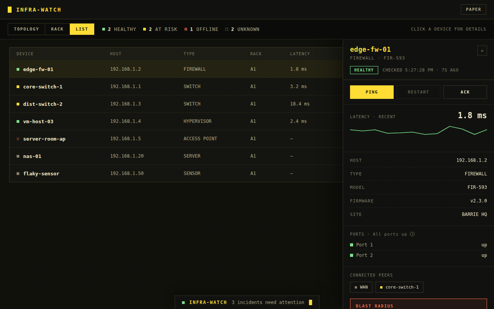

# Infra-watch

A local dashboard that monitors network and server-room device health and
lets you ask about status via chat.

## Screenshots


Topology — live dependency map with animated links.


Rack — physical elevation view of the same devices.


List — sortable table of every monitored device.


Drawer — per-device detail, latency history, and connected peers.

## What it does

- Monitors device reachability on a fixed interval and on demand.
- Shows the same device set three ways: Topology, Rack, and List.
- Answers questions about current status through a chat interface backed
  by Gemini.
- Never reports a device as "up" without a verified check for that cycle.

## Running it

1. Clone the repo and open it:

   ```bash
   git clone <repo-url>
   cd infra-watch
   ```

2. Create and activate a virtual environment:

   ```bash
   python3 -m venv venv
   source venv/bin/activate
   ```

3. Install dependencies:

   ```bash
   pip install -r requirements.txt
   ```

4. Copy the env file and add your key:

   ```bash
   cp .env.example .env
   ```

   Then set `GEMINI_API_KEY` in `.env`.

5. Optional — for offline/demo mode with no real network checks, add this
   to `.env`:

   ```bash
   INFRA_WATCH_USE_FIXTURES=1
   ```

6. Start the server:

   ```bash
   py -m uvicorn main:app --reload
   ```

   On Mac/Linux:

   ```bash
   python3 -m uvicorn main:app --reload
   ```

7. Open `http://localhost:8000`.

## Status vocabulary

Every device shows as one of HEALTHY, AT RISK, OFFLINE, or UNKNOWN. A
device only ever shows HEALTHY or up if a real check confirmed it during
the current cycle — a check that fails, times out, or was never run
reports UNKNOWN instead, never a guess.

## Notes

Per-port and topology detail are fixture/simulated data until real SNMP
monitoring is added — see `ROADMAP.md` for the current backlog.
